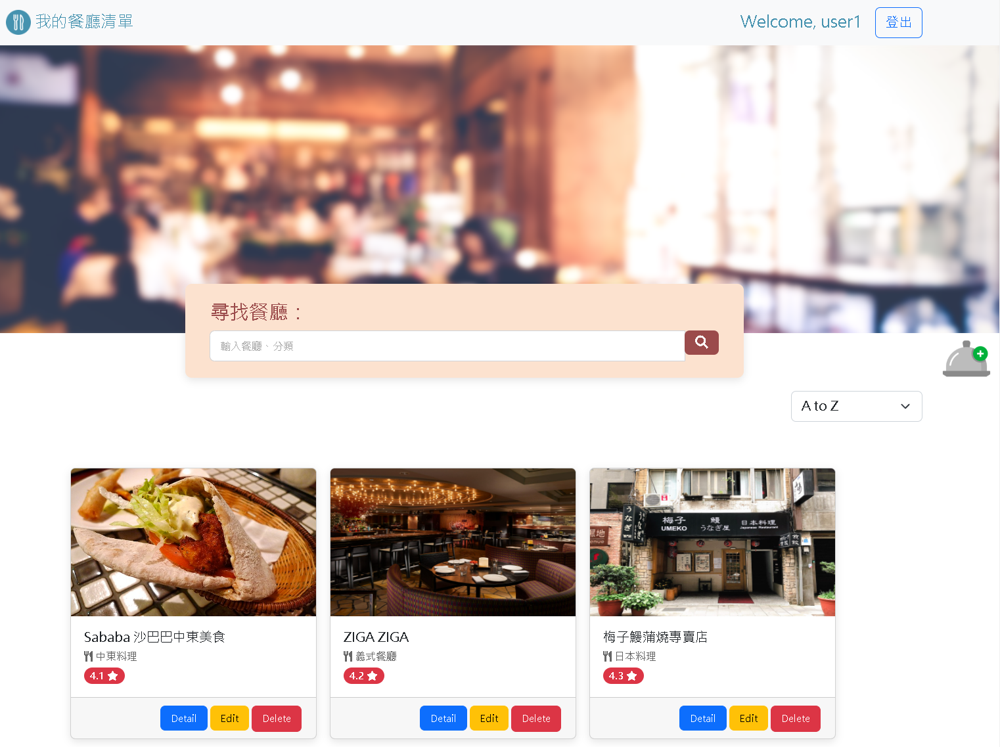
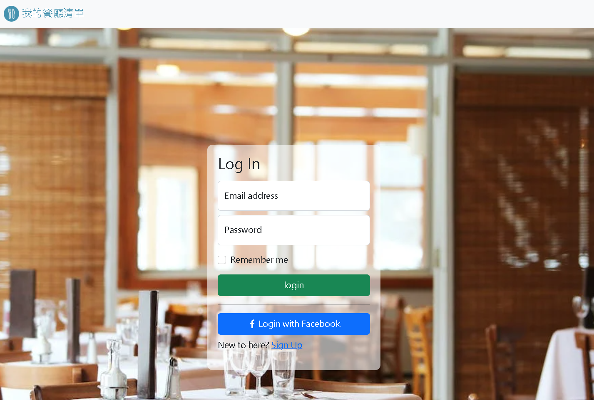

# Restaurant List




## User Story

This web application allows you to:

1. Discover restaurants and search for them using keywords.
2. Add, update, and remove restaurants from your list.
3. Register an account using the default system or log in with your Facebook account to manage your restaurant data.

## Getting Started

> Make sure `Node.js` and `MySQL` is installed on your machine

### Installation

1. Clone the repo

   ```bash
   git clone https://github.com/Jerry-Chang975/My-Restaurant-List.git
   ```

2. Go to the project directory

   ```bash
   cd My-Restaurant-List
   ```

3. Install the required npm packages

   ```bash
   npm install
   ```

### Database Configuration

1. Create config.json in config folder, your can refer config.example.json

   ```
   ├──config
       ├──config.json
       └──config.example.json
   ```

   You have to set database connection parameters in config.json

   ```json
   {
     "development": {
       "username": "your username",
       "password": "your password",
       "database": "restaurant",
       "host": "your host",
       "dialect": "mysql"
     }
   }
   ```

2. Create new database in your MySQL server

   ```MySQL
   CREATE DATABASE `restaurant`
   ```

3. Run database migrations

   ```bash
   npm run migration
   ```

4. Add seed data

   ```bash
   npm run seed
   ```

### OAuth2 App Configuration

1.  GO to [Meta for Developers](https://developers.facebook.com/apps) to set up the OAuth2 configurations for your app.

2.  After creating the app, copy the App ID and App Key to your .env file (you need to create this file yourself).

### Start the Web App

```bash
$ npm run start
```
